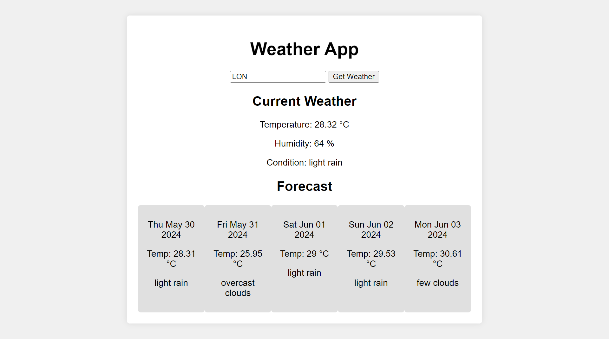

# Weather App

A simple weather application that allows users to fetch and display the current weather and a forecast for the next few days based on user input for a city. This project uses jQuery to handle user interactions and fetch data from the OpenWeatherMap API.

## Features

- Fetch and display current weather conditions
- Display temperature, humidity, and weather condition
- Show a 5-day weather forecast
- Responsive design

## Demo

[Live Demo](https://iurecastro.github.io/weather-app/) 

## Screenshots

 

## Getting Started

Follow these instructions to set up the project on your local machine for development and testing purposes.

### Prerequisites

- A web browser
- Internet connection
- OpenWeatherMap API key

### Installation

1. Clone the repository:

```sh
git clone https://github.com/your-github-username/weather-app.git
cd weather-app
```
2. Open index.html in your preferred code editor and replace YOUR_API_KEY in script.js with your actual OpenWeatherMap API key.

```sh
var apiKey = 'YOUR_API_KEY'; // Replace with your OpenWeatherMap API key
```

3. Open index.html in your web browser to view the application.

